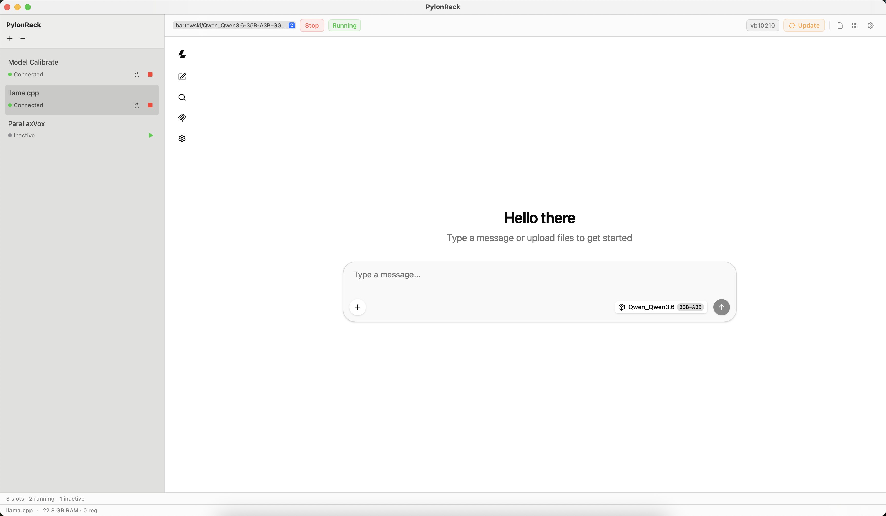
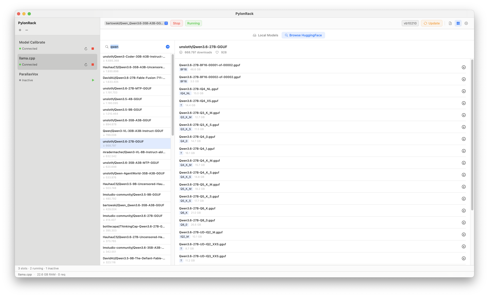
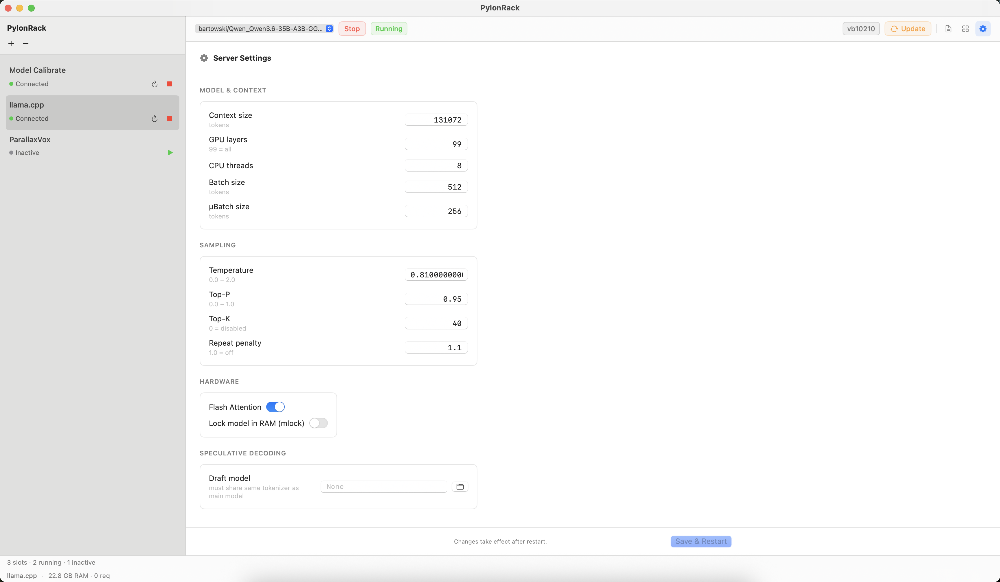

# pylonrack-llama

PylonRack slot application for **llama.cpp** — a native control surface for
quickly discovering, downloading, selecting, updating and trying local GGUF
models without moving between terminal commands and separate applications.

It is not intended to replace Ollama or LM Studio. It keeps llama.cpp itself at
the centre: the original built-in chat UI is embedded unchanged, while the
native rack adds the operational controls around it.



---

## What it does

- **Model dropdown** — quickly switches between GGUF models already available
  in the configured local Hugging Face cache
- **Start / Stop** — launches and stops `llama-server` with your configured parameters
- **Version and update state** — reports the built llama.cpp version and exposes
  Update or Rebuild only when action is needed, with live build output
- **Metrics** — RAM usage and active requests shown in the status bar
- **Log** — llama-server stdout streamed live to the rack log panel
- **Chat UI** — llama.cpp built-in web UI displayed in the rack body panel (served directly by llama-server on the same port)
- **Model Manager** — inspect locally available models or search Hugging Face,
  compare GGUF quantizations and download a selected file

## Native header

PylonRack keeps the controls needed during everyday use in the native header:

| Control | Purpose |
|---|---|
| Model dropdown | Switch the active local GGUF model |
| Start / Stop | Control the managed `llama-server` process |
| Status | Show transitions such as Idle, Starting, Running and Updating |
| `vbNNNN` | Report the currently built llama.cpp version |
| Update | Pull and rebuild llama.cpp when an update or rebuild is needed |
| Document | Toggle the process log |
| Grid | Toggle between llama.cpp chat and model management |
| Gear | Open per-model server and sampling settings |

## Browse Hugging Face

Search GGUF repositories, inspect their available files and quantizations, and
download a selected model without leaving PylonRack.



The model manager also has a Local Models view for inspecting or removing files
already present in the cache. The model dropdown in the header remains the
fastest way to switch the model used by `llama-server`.



---

## Requirements

- macOS 14+ (Apple Silicon recommended)
- Python 3.11+
- [llama.cpp](https://github.com/ggerganov/llama.cpp) — cloned and compiled (see below)
- [cmake](https://cmake.org/) — required for update/rebuild: `brew install cmake`
- [git](https://git-scm.com/) — for update detection
- HuggingFace cache with `.gguf` model files
- [PylonRack](https://github.com/marianvid/pylonrack) installed

---

## Building llama.cpp (required before first use)

Follow the [official llama.cpp build instructions](https://github.com/ggerganov/llama.cpp/blob/master/docs/build.md). On macOS, Metal is enabled by default:

```
git clone https://github.com/ggerganov/llama.cpp
cd llama.cpp
cmake -B build
cmake --build build --config Release -j
```

The compiled binary will be at `build/bin/llama-server`. Note this path — you'll need it in `settings.json`.

---

## Installation

### 1. Install cmake (if not already installed)

```
brew install cmake
```

### 2. Clone

```
git clone https://github.com/marianvid/pylonrack-llama
cd pylonrack-llama
```

### 3. Install dependencies

```
pip install -r requirements.txt
```

### 4. Configure `settings.json`

```json
{
  "llama_bin":     "/path/to/llama.cpp/build/bin/llama-server",
  "llama_repo":    "/path/to/llama.cpp",
  "hf_cache":      "/path/to/HuggingFace/hub",
  "log_file":      "~/.pylonrack/llama-server.log",
  "openwebui_url": "http://localhost:1234",
  "server": {
    "host":         "0.0.0.0",
    "port":         1234,
    "ctx_size":     131072,
    "n_gpu_layers": 99,
    "parallel":     2,
    "threads":      8,
    "batch_size":   512,
    "ubatch_size":  256
  }
}
```

| Key | Description |
|-----|-------------|
| `llama_bin` | Absolute path to compiled `llama-server` binary |
| `llama_repo` | Absolute path to the llama.cpp git repo (for update detection and rebuild) |
| `hf_cache` | Absolute path to your HuggingFace hub cache directory |
| `openwebui_url` | URL of the llama.cpp built-in UI — same port as `server.port` (default `http://localhost:1234`) |
| `server.port` | Port llama-server listens on — also where the chat UI is served |

`settings.json` is gitignored — your paths stay local.

---

## Adding to PylonRack

1. Open PylonRack (menu bar icon)
2. Click `+` and select this folder
3. Press ▶ to activate

---

## Update mechanism

- At startup and every 30 minutes, checks for new commits and binary staleness
- **Orange badge** — new commits available on origin
- **Red badge** — binary version is behind git commit count (needs rebuild)
- Click the version button to: stop llama-server → `git pull` → `cmake -B build` → `cmake --build build --config Release -j` → restart
- Full build output streams live to the log panel
- After successful build, version label updates automatically

### cmake PATH requirement
`cmake` must be installed and findable. The slot uses `shutil.which("cmake")` with fallback to `/opt/homebrew/bin/cmake`. If cmake is not found: `brew install cmake`.

---

## File structure

```
pylonrack-llama/
├── rack.json           ← PylonRack slot manifest
├── settings.json       ← local configuration (gitignored)
├── start.sh            ← venv bootstrap + launch
├── server.py           ← WebSocket server (PylonRack protocol)
├── config.py           ← configuration loader
├── llama_server.py     ← llama-server process lifecycle
├── model_scanner.py    ← HF cache scanner
├── git_updater.py      ← git fetch/pull + cmake rebuild
├── requirements.txt
└── tests/              ← pytest test suite
```

---

## License

MIT — use freely, no warranty.

PylonRack is a personal human–AI collaboration. It was designed and directed
by an experienced software developer exploring native macOS and Swift
development for the first time, with AI assisting implementation, testing and
documentation. Use at your own risk.
